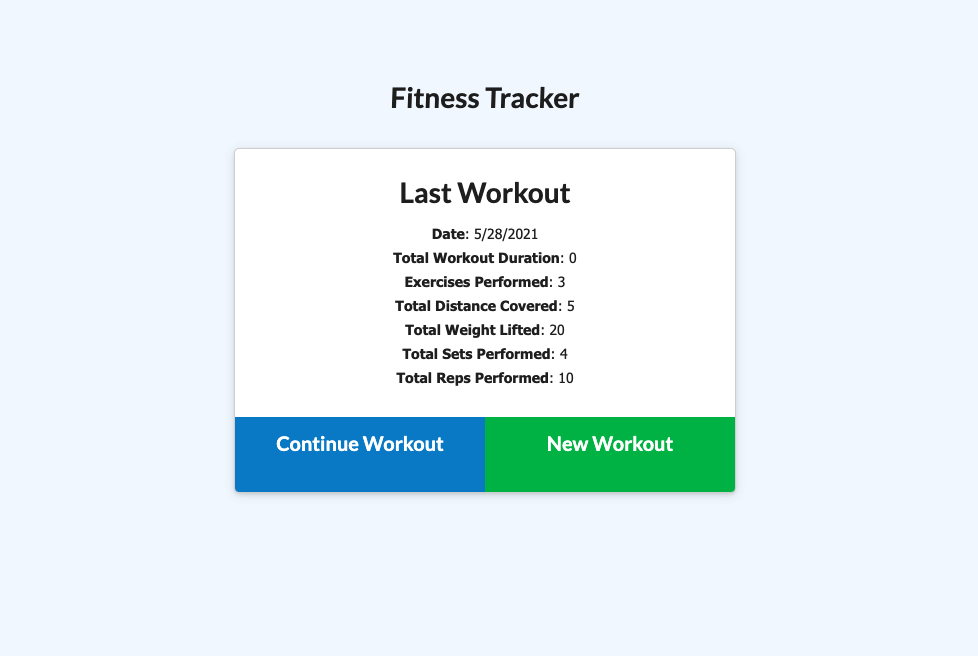
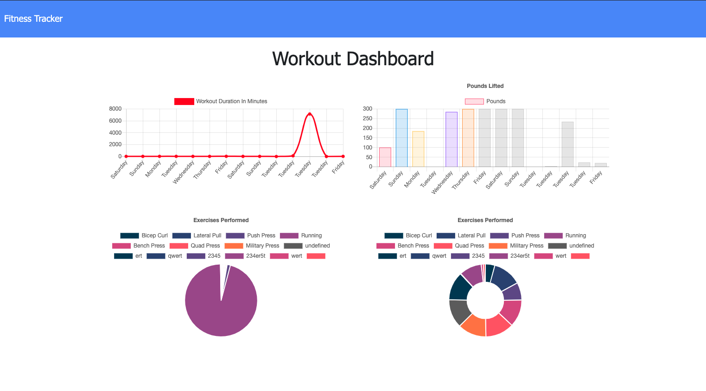

## Fitter Bug

[](https://lbesson.mit-license.org/)

- [Description ](#description)
- [Installation and Usage](#installation-and-use)
- [License](#license)




# Description

Fitter Bug is a simple app that allows the user to keep track of their workouts so they can be better organized in the pursuit toward their fitness goals.

The app is built with Node.js, Express, Mongo DB, and Mongoose; and is deployed on Heroku via the following link: https://thawing-tor-77281.herokuapp.com/?id=60b69fef18560b00157af89b

# Installation and Use

Clone the repo and open the folder in the code editor of your choice.

Make sure you have MongoDB installed on your local machine, and then create a mongo database called 'workout' with a collection called 'workouts'.

Next, install the necessary dependencies by running the following command from the terminal in the root directory:

```
npm i
```

Next, seed the database by running:

```
npm run seed
```

Finally, start the server on localhost3000 via:

```
npm start
```

# License

[MIT License](https://opensource.org/licenses/MIT)
